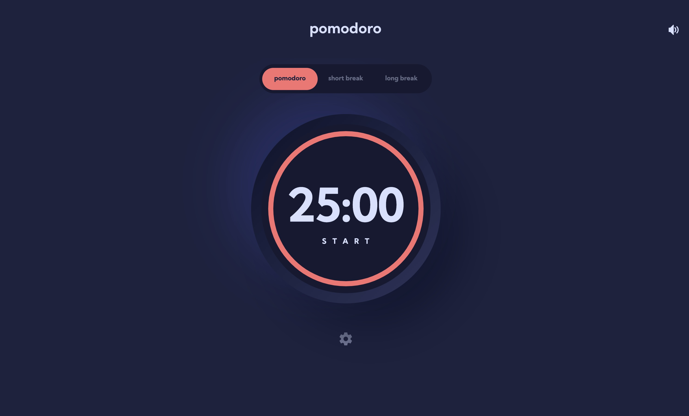

# Frontend Mentor - Pomodoro app solution

This is a solution to the [Pomodoro app challenge on Frontend Mentor](https://www.frontendmentor.io/challenges/pomodoro-app-KBFnycJ6G). Frontend Mentor challenges help you improve your coding skills by building realistic projects. 

## Table of contents

- [Overview](#overview)
  - [The challenge](#the-challenge)
  - [Bonus challenges](#bonus-challenges-for-myself)
  - [Screenshot](#screenshot)
  - [Links](#links)
- [My process](#my-process)
  - [Built with](#built-with)
  - [What I learned](#what-i-learned)
  - [Useful resources](#useful-resources)
- [Author](#author)

## Overview

### The challenge

Users should be able to:

- Set a pomodoro timer and short & long break timers
- Customize how long each timer runs for
- See a circular progress bar that represents how far through their timer they are
- Customize the appearance of the app with the ability to set preferences for colors and fonts

### Extra challenges I added

Users should be able to:

- See animations when interacting with different elements on the page
- See reduced animations when using reduced motion settings on their OS
- Hear sound effects while interacting with the interface and when the timer finishes
- Toggle sounds on/off
- Navigate the app using a keyboard only
- Use a screen reader / voice over assistant to hear timer status updates when starting, pausing and completing timers

### Screenshot

### Links

<!-- - Solution URL: [Add solution URL here](https://your-solution-url.com) -->
- Live Site URL: [Pomodoro App](https://pomodoro-matthiassmith.vercel.app)

## My process

### Built with

- Mobile-first workflow
- Semantic HTML5 markup
- CSS custom properties
- CSS animations
- [TypeScript](https://www.typescriptlang.org/) - Static type definitions
- [React](https://reactjs.org/) - JS library
- [Styled Components](https://styled-components.com/) - For styles
- [useSound](https://www.npmjs.com/package/use-sound) - React hook for using sounds
- React Context API - for managing application state
- React custom hooks - to help listen for screen size changes

### What I learned

I increased my knowledge and skills with TypeScript, React, and application state during this project's development, but I'd have to say my two main takeaways from doing it are:

1. Building with accessibility in mind by adding it throughout application development is a much better approach than just adding it in at the end. Similar to mobile-first workflows, doing this helped me discover "gotchyas" within my markup and application code earlier on in the development process.
2. Adding sounds to web apps is much easier than I thought it would be, and better yet, can actually *improve* user's experiences.

    I haven't added sound effects into web apps before because I felt that they often hinder and annoy users, and because I thought it'd be difficult to do.
    
    However, what I found here was the opposite. 
    
    - For one thing, I personally feel that the sound effects add something to this application — giving it that extra bit of polish and thoughtfulness. Because when I'm using a pomodoro timer, I'm not staring at it — I'm off working in other browser tabs. Hearing the chime indicate that my timer has finished is really helpful. It's just the sort of thing that sounds do well while not overdoing it.
    
    - Furthermore, adding sounds was a straightforward process, and I was able to do so rather quickly. Finding and choosing sounds on the other hand, took way longer than I care to admit. 😅  

### Useful resources

- [CSS Tricks Progress Ring Tutorial](https://css-tricks.com/building-progress-ring-quickly/) - This article helped me implement the SVG progress ring.
- [MDN article on the "switch" role](https://developer.mozilla.org/en-US/docs/Web/Accessibility/ARIA/Roles/Switch_role) - Great resource on setting up accessible "switch" controls, which I used for the sound toggle.
- [MDN article on the "progressbar" role](https://developer.mozilla.org/en-US/docs/Web/Accessibility/ARIA/ARIA_Techniques/Using_the_progressbar_role) - Informative article on the use of the "progressbar" role and its accompanying attributes.
- [Wave's Web Accessibility Evaluation Tool](https://wave.webaim.org/) - This helped me to test my site's accessibility by giving me insights and errors related to accessibility concerns.

## Author

- Website - [My Portfolio](https://portfolio-matthiassmith.vercel.app)
- Frontend Mentor - [@MatthiasSmith](https://www.frontendmentor.io/profile/MatthiasSmith)
- Twitter - [@matthiasdev](https://twitter.com/matthiasdev)

